## Lucas Yukio Yotsui de Carvalho 🤖💻⚡

- 🎓 Graduando pela Universidade Federal de Santa Catarina
- 🔭 Membro do [Laboratório de Integração Software Hardware](https://lisha.ufsc.br/HomePage)
- 🖥️ Tenho experiência com programação de alto nível em Python e Flutter
- ⚙️ Tenho experiência também com programação de baixo nível com C e C++ 
- ⚡ Minha especialidade são Sistemas Embarcados, desenvolvendo tanto Firmware quanto Hardware
- 💼 Anteriormente membro do projeto OBNZIP em parceria com a Petrobras
- 🚗 Atualmente membro do projeto [IASE](https://lisha.ufsc.br/IASE-public) em parceria com a Renault

### Minha Formação
- **2017:** 📃 Certificação Toefl Jr - Nível B2 no CEFR
- **2017:** 🎓 Conclusão do Ensino Fundamental
- **2020:** 📃 Certificação Toefl ITP _(667/677)_ - Nível C1 no CEFR
- **2020:** 🎓 Conclusão do Ensino Médio
- **2021:** 🎓 Início da graduação em Engenharia Mecatrônica
- **2022:** 📃 Certificação Toeic _(985/990)_ - Nível C1 no CEFR

### Minha Experiência
#### 1. OBNZIP
Minha primeira grande experiência acadêmica, o projeto OBNZIP foi um projeto de iniciação científica do qual participei a convite do professor [Dr. Anderson Wedderhoff Spengler](https://lisha.ufsc.br/Anderson).

Este projeto teve como objetivo desenvolver formas de aprimorar os sensores OBN _(Ocean Bottom Nodes)_ utilizados pela Petrobras na exploração submarina de poços de petróleo. Minha contribuição no projeto foi voltada à parte de gerenciamento e transmissão sem fio de energia, na qual desenvolvi diversas atividades, tais como:
- 📖 Pesquisa de bibliografia científica para levantamento do estado da arte no ramo de transmissão de energia sem fio.
- 💻 Desenvolvimento de um algoritmo computacional em Python para modelagem de um sistema de transmissão sem fio de energia.
- ⚡ Desenvolvimento de sistema de geração de correnteza, com componentes modelados no Solidworks e produzidos com impressão 3D, desenvolvimento de sistema embarcado em ESP32 para controle de motor brushless e interface web para comunicação com o ESP32 e ajuste de velocidade do motor.

Aqui estão algumas imagens das atividades desenvolvidas:

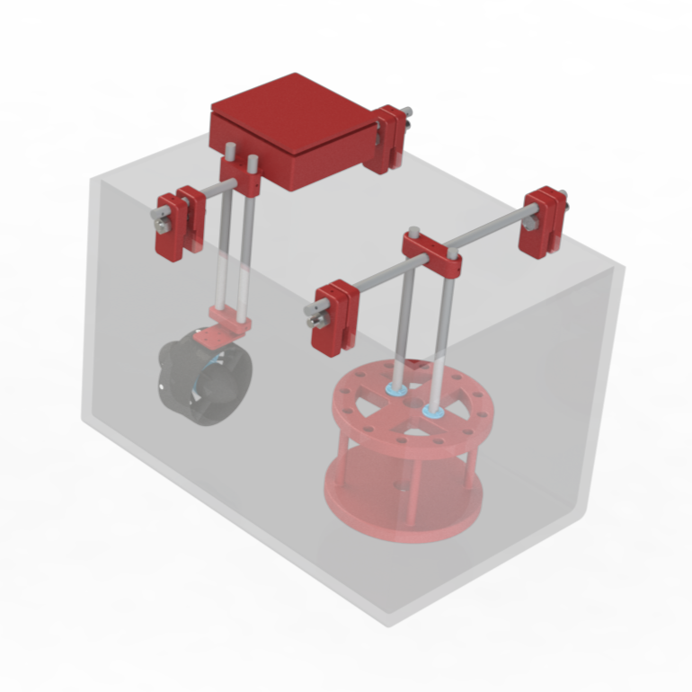
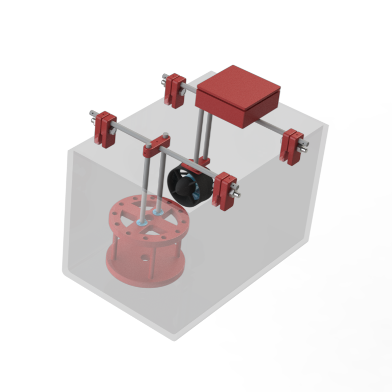
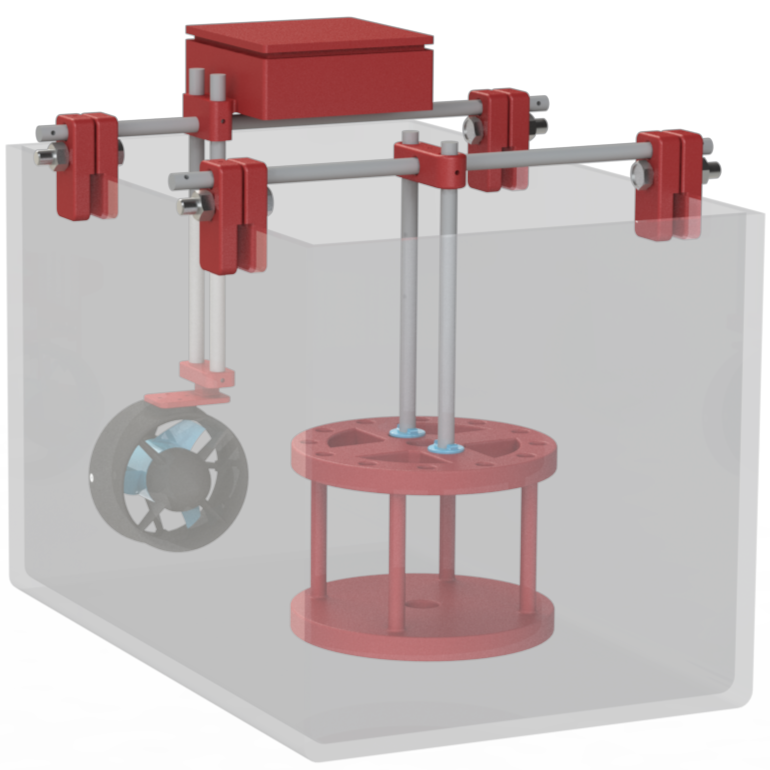
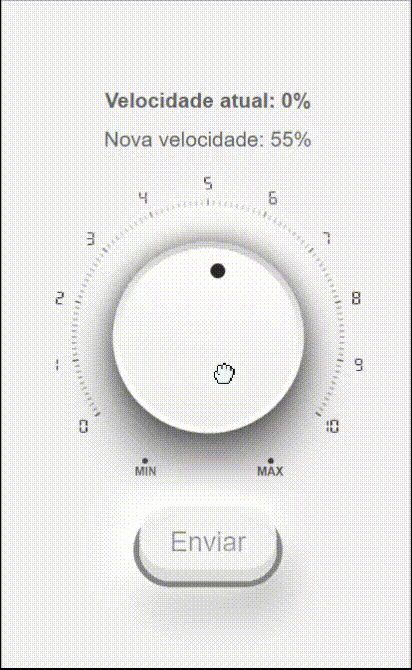

#### 2. IASE2
No período em que entrei para o projeto OBNZIP, o projeto IASE estava encerrando sua primeira fase. Após esse fim, ele foi renovado para uma nova etapa, chamada IASE2. Quando essa fase estava se iniciando, o professor Anderson me proporcionou mais uma nova oportunidade: transferir-me para o este novo projeto, o qual condiz mais com minha área de interesse e especialidade.

Este novo projeto, tinha como objetivo aprimorar a forma como são coletados dados durante os experimentos conduzidos em carros de teste na Renault. Isso é feito através de comunicação direta com a ECU _(Electronic Control Unit)_ dos veículos via protocolo CAN. 

Para isso, foi desenvolvido um sistema de ponta a ponta, baseado em um hardware desenvolvido especialmente para esse fim, rodando um firmware desenvolvido por nós, coletando dados e enviando-os para um servidor remoto, onde eles podem ser acessados pelos engenheiros da Renault. Dentro desse projeto, atuo em diversas etapas, como por exemplo:
- ⚒️ Modelagem no Solidworks de diversas versões de um case para o hardware do projeto
- ⚙️ Pesquisa, escolha e orçamento de componentes eletrônicos
- ⚡ Desenvolvimento do PCB integrando todo o hardware
- 💻 Desenvolvimento de firmware para comunicação com ECU
- 📱 Desenvolvimento de aplicativo Android para interface e controle do hardware

Aqui estão algumas imagens das atividades desenvolvidas:

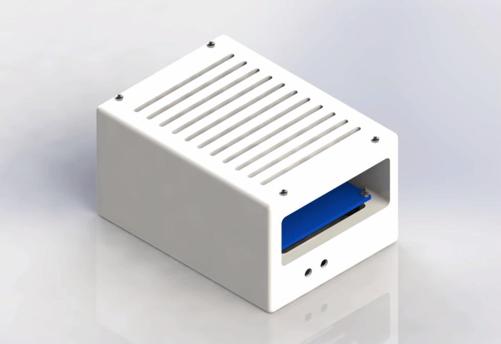
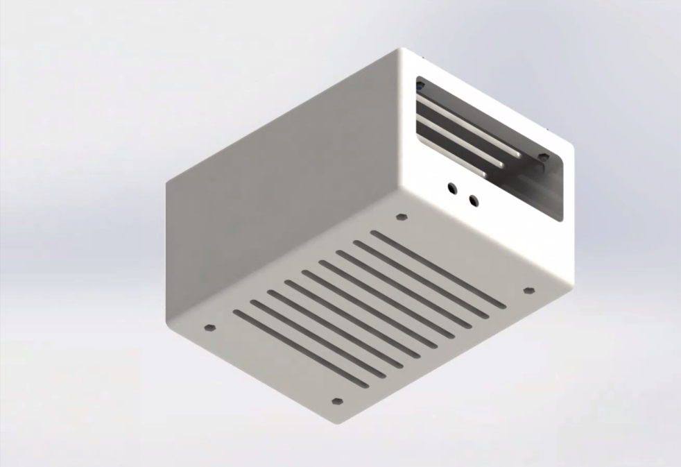
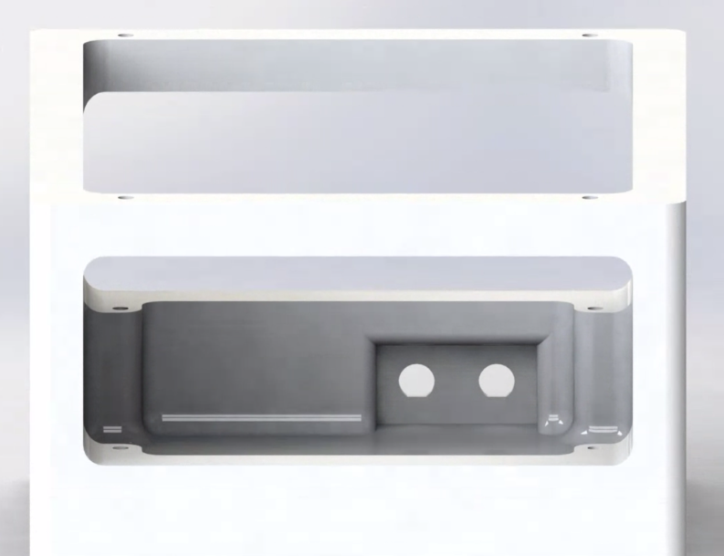

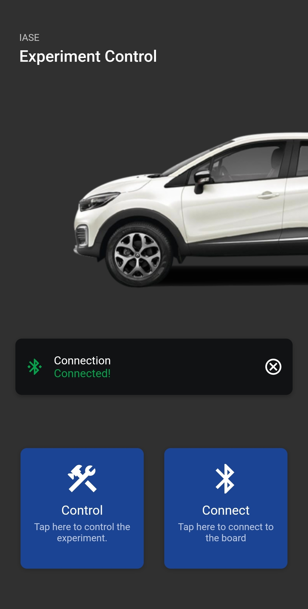
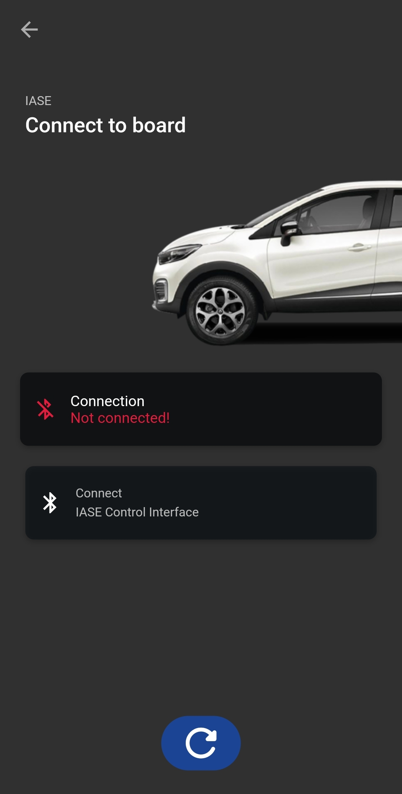

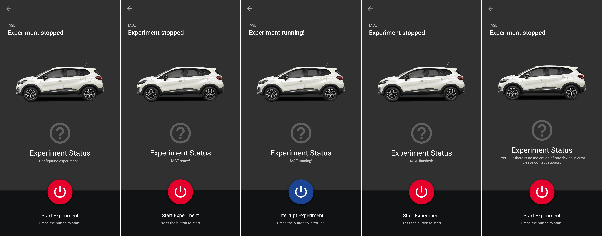

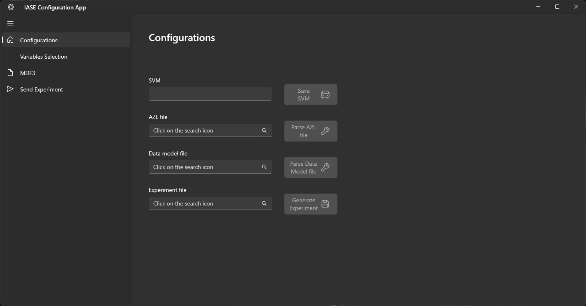
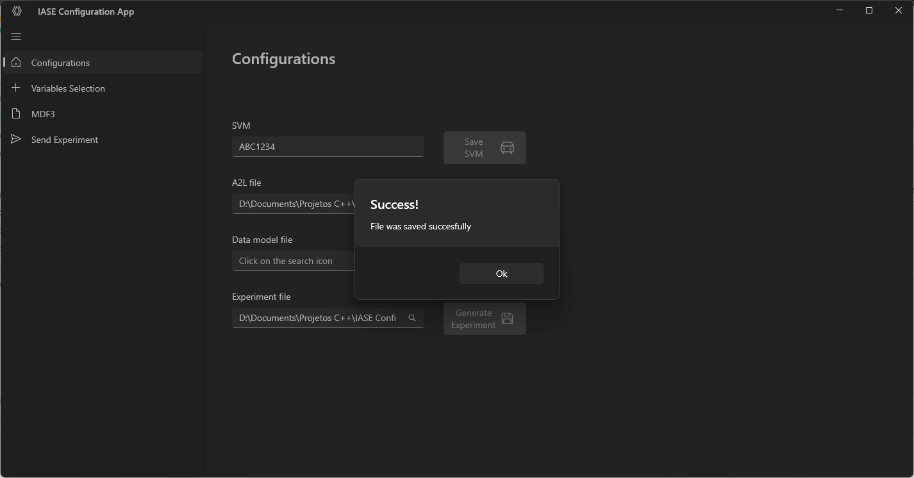
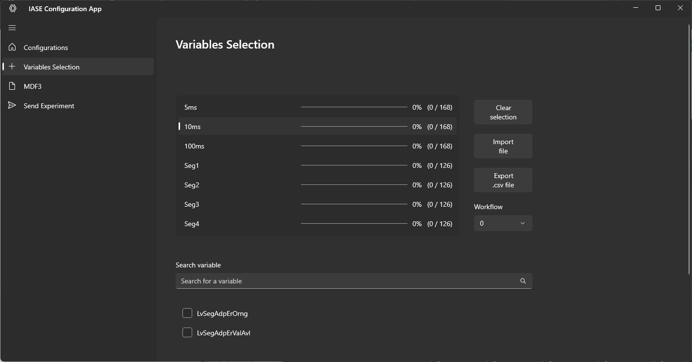
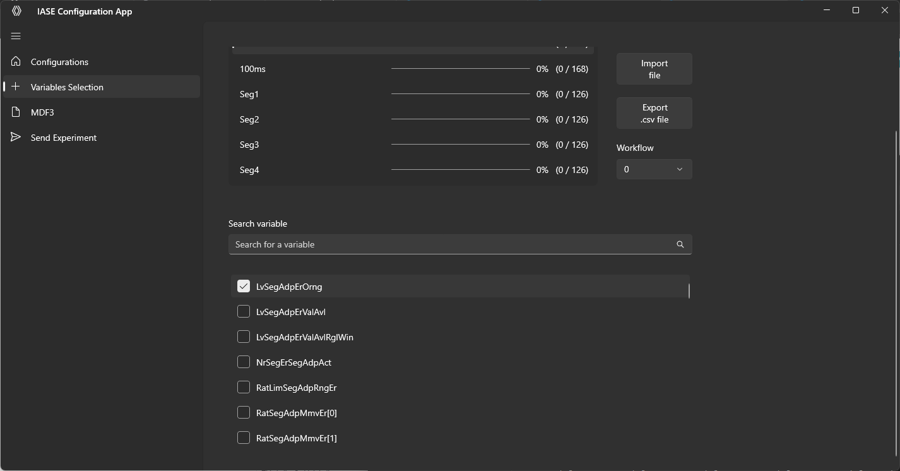

### Estatísticas Github

  
  

